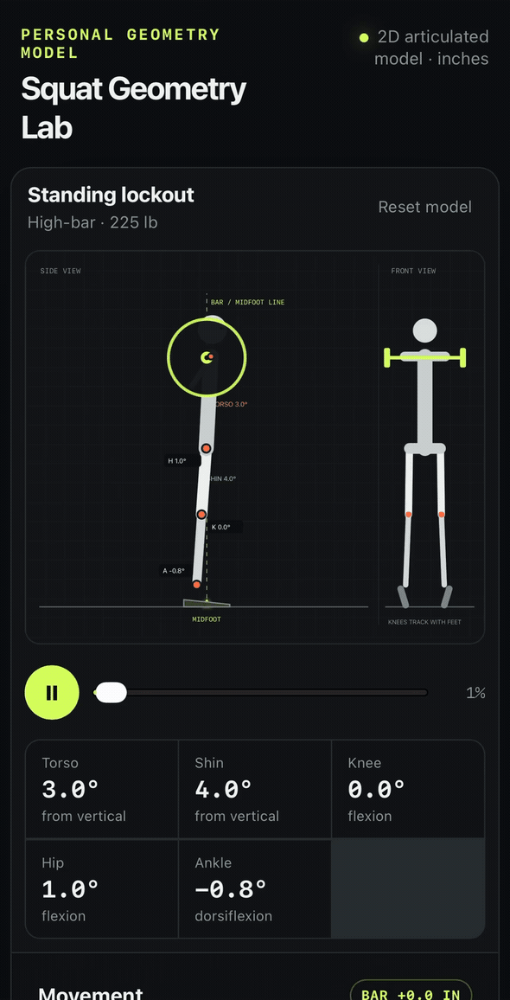
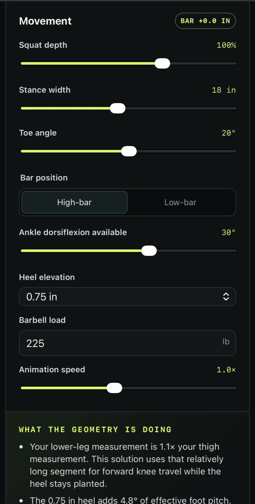
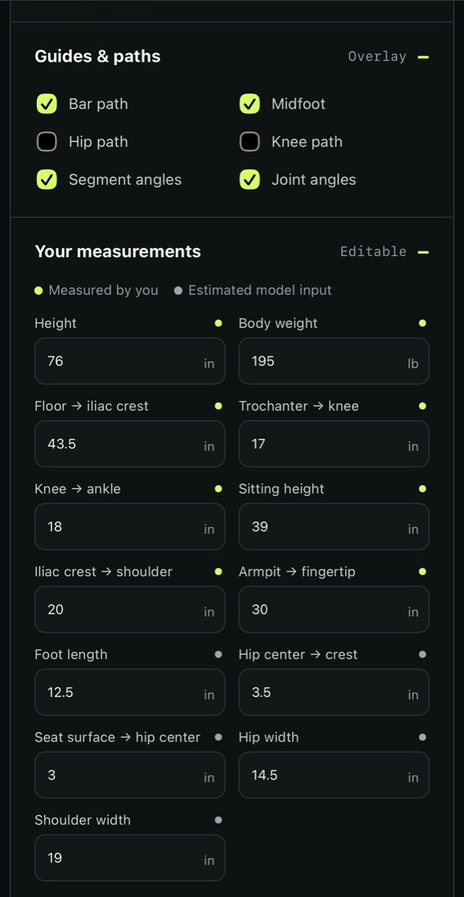

# Squat Geometry Lab

A dependency-free, interactive SVG model of back-squat geometry. It is an educational 2D model, not a technique assessment or medical tool.

<p align="center">
  
</p>

<p align="center">
  
  
</p>

## Run

```bash
npm start
```

Open <http://localhost:4173>.

```bash
npm run validate
```
